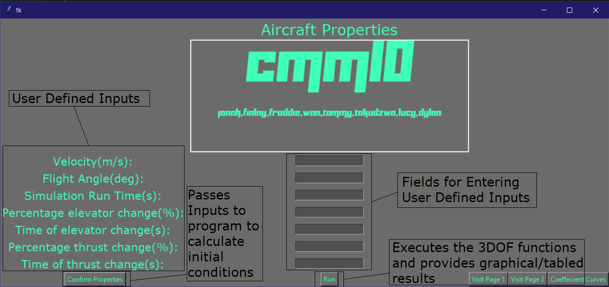

<b>CMM10 PROJECT</b>

A longitudinal simulation and modelling of small aircraft
requires Tkinter to run (version 0.1.0)-- run main.py to run application. 

<i> There is a lot to be improved in this code, but so is how it always goes with code... the GUI is in particular a mess on the back end but is functional. The main loop could do with some comuptational effeciency refactoring. but it works and is still a work in progress. Feel free to fork and pull request any changes to improve  - j </i>

<b> User Inter Face </b>

<b> Example Simulation <b>
